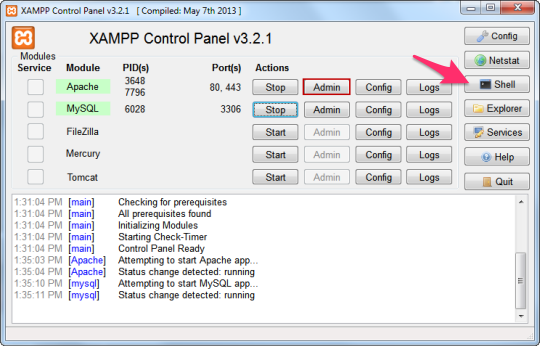
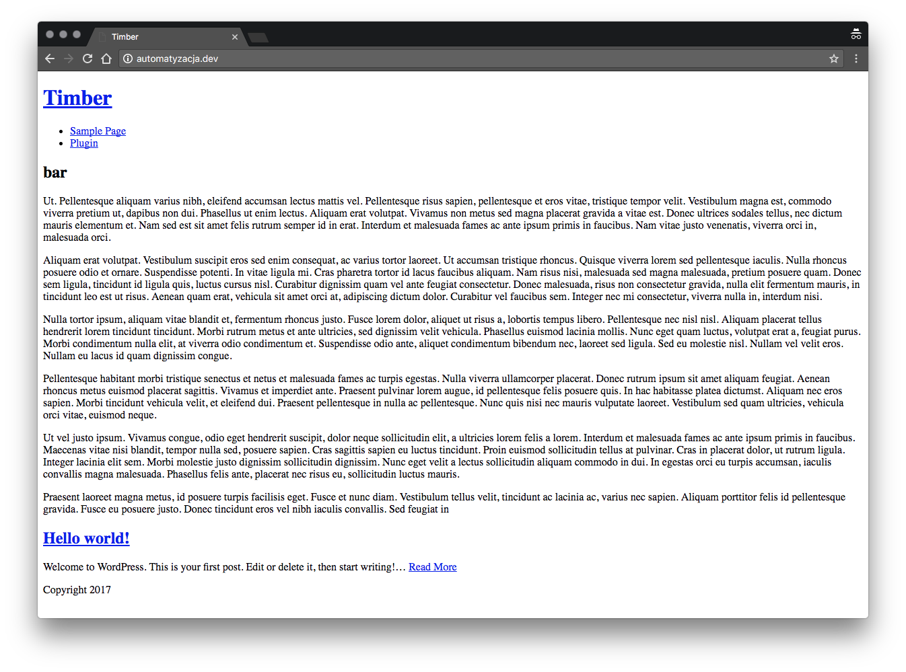

# Zanim zaczniemy

- czat - https://tlk.io/automatyzacja-wp
- Node.js w wersji 4.5+
- NPM
- Yarn (zalecany)
- Lokalny serwer WWW (MAMP, WAMP, LAMP)
    - Windows (XAMPP, WampServer)
- opcjonalnie Git
- możliwość odpalenia PHP z poziomu konsoli / wiersza poleceń
```
php -v
```

Przykładowy wynik polecenia:
```
PHP 5.6.29 (cli) (built: Dec  9 2016 11:14:08)
Copyright (c) 1997-2016 The PHP Group
Zend Engine v2.6.0, Copyright (c) 1998-2016 Zend Technologies
```

W razie problemów upewnij się, że PHP jest w PATH
- https://stackoverflow.com/questions/10753024/how-to-access-the-command-line-for-xampp-on-windows

Alternatywnie, narzędzia powinny mieć swoją konsolę np. XAMPP



# Instalacja

### Instalacja Yarna
```
npm install -g yarn
```

Dlaczego warto? Chisel domyślnie korzysta z Yarna ponieważ szybciej instaluje nam wszyskie paczki. Jak nie mamy Yarna to korzysta z npm, który jest nieco wolniejszy.

## Sprawdzamy czy mamy wszystko co jest na potrzebne:
```
node -v
npm -v
php -v
yarn - v
```

## Yeomen + Chisel generator
```
npm install -g yo generator-chisel
```

## Tworzymy pierwszy projekt

### Stwórz folder i wejdź do niego
```
mkdir nazwa_projetku 
cd nazwa_projektu
```

### Uruchom generator Chisel
```
yo chisel
```

#### Opcje instalatora
1. Nazwa projektu 
2. Autor projektu
3. Typ projektu 
    - wybieramy WordPress with Front-end
4. Możemy wybrać dodatkowo czy chcemy jQuery oraz wsparcie dla ES6 + Babel
    - spacją zaznaczamy pojedyńcze elemeny
    - srzałkami góra / dół przechodzimy między opcjami
    - wciśnięcie "a" spowoduje zaznaczenie wszystkich opcji (ang. all)
    - wciśnięcie "i" spowoduje odwrócenie zaznaczenia (ang. inverse)
5. Tytuł strony
6. Adres URL używany lokalnie
7. Nazwa użytkownika dla administratora
8. Hasło administratora
9. Adres email administratora
10. Gdzie mamy przechowywać pliki wersji deweloperskiej
    - bezpośrednio w "roocie" projektu
    - w folderze motywu
11. Ustawienia bazy danych
    - host
    - port
    - nazwa bazy
    - nazwa użytkownika
    - hasło
12. Instalacja popularnych wtyczek
    - ACF Pro
    - Gravity Forms
    - WP Sync DB
    - WP Sync DB Media File Addon
13. Potwierdzamy i czekamy aż wszystko się zainstaluje.
14. W międzyczasie ustawimy sobie Virtual Hosta

### Virtual host

#### Plik hosts

W pliku _hosts_ dodajemy naszego hosta. W zależności od systemu operacyjnego i konifiguracji plik ten może znajdować się różnych miejsach.
###### Windows
```
c:\Windows\System32\Drivers\etc\hosts
```
**Ważne:** Edytuj ten plik jako administrator. Najlepiej odpalić sobie notatnik poprzez prawy przycisk myszki i wybrać opcję _Uruchom jako administrator_. 
###### macOS (i inne Unixy w większości)
```
/etc/hosts
```

##### Edycja pliki i sprawdzanie

```
127.0.0.1 nazwa_projektu.dev
```
Po zapisaniu możemy sprawdzić czy działa poprawnie poprzez wydanie polecenia:
```
ping nazwa_projektu.dev
PING nazwa_projektu.dev (127.0.0.1): 56 data bytes
64 bytes from 127.0.0.1: icmp_seq=0 ttl=64 time=0.065 ms
64 bytes from 127.0.0.1: icmp_seq=1 ttl=64 time=0.071 ms
64 bytes from 127.0.0.1: icmp_seq=2 ttl=64 time=0.119 ms
```

#### Virtual host
W pliku _httpd.conf_ lub _http-vhost.conf_ należy ustawić odpowiednią scieżkę do naszego pliku _dev-vhost.conf_, który został utworzony na podstawie danych podanych podczas procesu instalacji.

```
IncludeOptional /sciezka/do/projektow/*/dev-vhost.conf
```
Minusem takiego rozwiązania jest to, że teraz każdy projekt musi mieć plik dev-vhost.conf, inaczej Apache będzie zwracał błąd. W takim przypadku można zlinkować pojedyńczy plik:
```
IncludeOptional /sciezka/do/projektow/nazwa_projektu/dev-vhost.conf
```

**Ważne**: Po wszystkim zrestuj Apache
```
#macOS
sudo apachectl restrart
#Ubuntu
sudo service apache2 restart
```

Możliwe, że vhost nie będzie działał. W tym przypadku pierwszym krokiem jest dodanie nazwy naszej lokalnej domeny w pliku _dev-vhost.conf_

```
<VirtualHost nazwa_projetku.dev:80>
    DocumentRoot "/Users/marcin/Sites/private/automatyzacja/wp"
    ServerName automatyzacja.dev
    <Directory "/Users/marcin/Sites/private/automatyzacja/wp">
      AllowOverride All
      Require all granted
    </Directory>
</VirtualHost>
```

Jeśli to nie pomoże to możemy używać projektu po adresie localhost. Należy pamiętać aby zmienić w takim razie w tabeli _wp_options_ adres strony, a także w pliku _gulp/tasks/serve.js_
```
# przed
target: generator_config.proxyTarget || name+'.dev',

# po 
target: http://localhost/~marcin/nazwa_projektu/,
``` 

### Projekt jest gotowy do pracy

Jeśli wszystko poszło prawidłowo to po otwarciu przeglądąrki i wpiasaniu w pasku adresu http://nazwa_projektu.dev powinnyśmy zobaczyć stronę startową naszego projektu.




# Omówienie struktury
- **gulp** - zadania Gulpa
- **node_modules** - moduły Node.js do realizacji zadań Gulpa 
- **src** - pliki źródłowe
    - **assets** - czcionki, pliki graficzne, itp
    - **scripts** - pliki JavaScript
    - **app.js** - główny plik JavaScript
    - **greeting.js** - przykładowy moduł JS
    - **styles** - pliki Sass w architekturze ITCSS
        - **components** - komponenty, większość kodu tworzymy tutaj
        - **elements** - generyczne elementy HTML (h1, a, itd), bez klas czy ID
        - **generic** - reset / normalize, box-sizing itp
        - **objects** - selektory oparte na klasach, nie zawierają styli dekorujących 
        - **settings** - ustawienia 
        - **tools** - narzędzia czyli wszyskie funkcje, mixiny itp
        - **utilities** - narzędzia pomocniczne, ładowane na końcu i nadpisujące wszystkie style
        - **vendor** - dodatkowe biblioteki, itp
        - **main.scss** - główny plik Sass, importujące wszystkie moduły naszej architektury 
- **wp** - folder z WordPressem
    - **wp-content/themes/nazwa_projektu/** - automatycznie utworzony motyw
        - **dist** - miejsce docelowe na pliki CSS, JS, obrazki itp
        - **templates** - szablony Twiga
        - **index.php** - pliki wymagane przez WP (Chisel Starter theme file) 
        - **functions.php**
        - ...
    - **wp-config-local.php** - lokalna konfiguracja WP
- **.editorconfig** - zapewania jendolite formatowanie w plikach projektu
- **.eslintignore** - pomijaj wskazane pliki / folderu przy walidacji eslint
- **.eslintrc.yml** - konfiguracja eslint
- **.gitattributes** - konfiguracja wymuszająca Unixowe zakończenie pliku w plikach tekstowych
- **.gitignore** - pomijaj wskazane pliki / foldery przy używaniu Gita
- **.htmlhintrc** - konfiguracja htmllint
- **.stylelintignore** - pomijaj wskazane pliki / foldery przy walidacji stylelint
- **.stylelintrc.yml** - konfigruacja stylelint
- **.yo-rc.json** - konfiguracja Yeomana
- **dev-host.conf** - konfiguracja Virtual Host
- **gulpfile.js** - importuje zadania Gulpa z folderu gulp/ i uruchamia odpowiednie zadania w zależności od wydanego polecenia
- **package.json** - konfiguracja zależności NPM

## Uwaga na temat pliku wp-config-local.php

Plik _wp-config.php_ jest zmodyfikowany na potrzeby Chisela. W przypadku lokalnej pracy konfiguracja bazy danych i inne zmienne definujemy w pliku _wp-confg-local.php_. Plik ten domyślnie jest dodawany do .gitignore, więc nie ma obaw, że zostanie wysłany do repozytorium.

## Autoprefixer
- https://github.com/postcss/autoprefixer
- https://autoprefixer.github.io/
- http://browserl.ist/

Czyta zawartość naszego CSSa i dodaje niezbędne prefiksy do właściwości CSSa

### Autoprefixer - Zmiana domyślnych ustawień

Domyślnie narzędzie wspiera:
```
> 1%, last 2 versions, Firefox ESR.
```

Niestety nie daje nam to wsparcia dla chociażby IE 10 / 11 czy starszych wersji iOSa (iPhone 5/5S). 

Aby zmienić domyślne ustawienia w pliku _package.json_ należy dodać nową sekcję:

```
"browserslist": [
    "last 2 version",
    "> 1%",
    "iOS >= 6"
  ]
```

Aby sprawdzić jakie przeglądarki będą wspierane polecam stronę http://browserl.ist/ i wpisanie po przecinku wartości z naszej konfiguracji.

# Praca nad projektem

## Odpalenie wersji deweloperskiej
```
npm start #npm run dev, npm watch, gulp
```
Wydanie tego polecenia uruchomi lokalny serwer browser-sync i otworzy automatycznie nowe okno przglądarki pod adresem _http://localhost:3000_. Dzięki zastosowaniu proxy z browser-sync mamy dostęp do naszej instalacji widniejącej pod adresem _http://nazwa_projektu.dev_

## Testowanie wersji produkcyjnej

Aby stworzyć nową wersję / rewizję naszego projektu, który będzie użyty na produkcji należy wydać polecenie:
```
npm run build
``` 
W momencie uruchomienia powyższej komendy te kroki są wykonane:

1. Folder _dist_ zostanie wyczyszczony (usunięte wszystkie pliki)
2. Zostaną wykonane zadania związanie ze stworzeniem docelowej wersji plików CSS oraz JavaScript.
    - w przypadku kiedy nasz kod posiada błędy zostaniemy o tym poinformowami przez narzędzia jak eslint, stylelint, itp. Jeśli linter zwracają errory należy je naprawić ponieważ build się się nie wykona. Warninigi możemy zingnorować aczkolwiek jesli mamy czas to warto także zadbać o brak warningów.
3. Plik rev-manifest.json zostanie zaktualizowany o wpisy dotyczące najnowszych wersji.

## Dodawanie nowych stron

Z poziomu wiersza poleceń / terminala wydaj polcenie
```
yo chisel:page "Nazwa strony"
```

Jeśli chcesz dodać wiele stron jednocześnie możesz to zrobić poprzez wydanie poniższego polecenia:
```
yo chisel:page "O firmie" "Oferta" "Kontakt"
```

Po wydaniu takiego polecania zostaną utworzone trzy strony w bazie danych a także stworzonę zostaną szablony Twiga dzięki czemu będziey mogli ostylować strony jak chcemy.

```
wp-content/themes/nazwa_projektu/templates/page-o-firmie.twig
wp-content/themes/nazwa_projektu/templates/page-oferta.twig
wp-content/themes/nazwa_projektu/templates/page-kontakt.twig
```

## Timber

Odysłam do prezentacji jaką robiłem na jeden z lokalnych meetupów WordPressa w Poznaniu.

- https://krzeminski.net/talks/timber-wprowadzenie/

### Wskazówka odnośnie długich klas i modyfikatorów

```twig
<article class="{{
  className(
    'c-some-post',
    'red',
    'type-' ~ post.type,
    (post.thumbnail ? 'has-thumbnail')
  )
}}"></article>
```
Wynik użycia funkcji className:
```twig
<article class="c-some-post c-some-post--red c-some-post--type-post"></article>
```

# JavaScript

Chisel zawiera wsparcie dla ES2015 przy pomocy Babela, a także korzysta z Browersify + Watchify jak mechanizmu zarządzania zależnościami.

##  Używanie pluginów jQuery z Browersify

1. Zainstaluj jQuery 
```
npm install --save jquery
```
2. Daj globalny dostęp do jQuery
```javascript
window.jQuery = window.$ = require('jquery');
```
3. Załaduj wymagany plugin
```javascript
require('flexslider');
```

## Używanie pluginów / blibliotek spoza NPM

Skorzystaj z https://github.com/thlorenz/browserify-shim#you-will-always

@todo - przykład użycia

# wp-cli

- http://wp-cli.org/ - oficjalna strona
- https://developer.wordpress.org/cli/commands/ - dokumentacja

Pozwala na zarządzanie WP poprzez linię poleceń. Dzięki _wp-cli_ jesteśmy wstanie m.in:
- instalować / aktualizować WP
- zarządzać
    - postami i stronami
    - komentarzami
    - wtyczkami
    - użytkownikami
    - bazą danych
    - mediami
    - i wiele, wiele innych

## Instalacja WordPressa
- https://developer.wordpress.org/cli/commands/core/
- https://developer.wordpress.org/cli/commands/core/download/
https://developer.wordpress.org/cli/commands/config/create/
- https://developer.wordpress.org/cli/commands/core/install/

```
wp core download --locale=pl_PL
wp core config --dbname=wpcli --dbuser=root --dbpass=root
wp core install --url=example.com --title=Example --admin_user=marcin --admin_password=marcin --admin_email=marcin@iwiz.pl
```

## Zarządzanie postami / stronami / typami postów
- https://developer.wordpress.org/cli/commands/post/

### Lista
- https://developer.wordpress.org/cli/commands/post/list/

```
# Wszystkie wpisy
wp post list
# Wszystkie strony
wp post list --post_type=post
```

### Dodawanie
- https://developer.wordpress.org/cli/commands/post/create/

```
# Dodanie strony Oferta - domyślny status to szkic
wp post create --post_type=page --post_title='Oferta'

# dodanie 1 strony z pliku tekstowego ze statusem opublikowany
wp post create ~/Desktop/Warsztat/Strony/oferta.txt --post_type=page --post_title="Nowa oferta z pliku" --post_status=publish
```

### Generowanie postów
- https://developer.wordpress.org/cli/commands/post/generate/

```
# domyślnie doda 100 wpisów
wp post generate

# dodanie 5 stron
wp post generate --post_type=page --count=5

# dodanie 10 wpisów z tekstem Lorem Ipsum
curl http://loripsum.net/api/5 | wp post generate --post_content --count=10
```

### Usuwwanie
- https://developer.wordpress.org/cli/commands/post/delete/

```
# Usunięcie posta o id = 21
wp post delete 21 

# Usunięcie posta o id = 21 z pominięciem kosza
wp post delete 21 --force

# Usunięcie wszystkich stron z kosza
wp post list --post_status=trash --format=ids --post_type=page | xargs wp post delete
```

### Szczegóły 
- https://developer.wordpress.org/cli/commands/post/get/

```
wp post get 1
```

### Zadanie
- dodaj kilka wpisów oraz stron i je usuń

## Zarządzanie Wtyczkami
- https://developer.wordpress.org/cli/commands/plugin/

### Lista
- https://developer.wordpress.org/cli/commands/plugin/list/
```
wp plugin list
```

### Wyszukiwanie
- https://developer.wordpress.org/cli/commands/plugin/search/

```
wp plugin search "duplicator"
```

### Instalacja
- https://developer.wordpress.org/cli/commands/plugin/install/

```
# instalacja najnowszej wersji i aktywacja
wp plugin install wp-page-duplicator --activate

# instalacja z lokalnego pliku zip
wp plugin install ~/Desktop/Warsztat/Wtyczki/autoptimize.2.1.0.zip
```

### Aktywacja / deaktywacja wtyczki
- https://developer.wordpress.org/cli/commands/plugin/activate/
- https://developer.wordpress.org/cli/commands/plugin/deactivate/

```
# włączenie
wp plugin activate autoptimize
#wyłączenie
wp plugin deactivate autoptimize

# zmiana stanu 
wp plugin toggle autoptimize
```

### Aktualizacja wtyczek
- https://developer.wordpress.org/cli/commands/plugin/update/

```
# wybrana wtyczka
wp plugin update autoptimize
# wszystkie
wp plugin update --all 
```

### Usuwanie wtyczek
- https://developer.wordpress.org/cli/commands/plugin/deactivate/
- https://developer.wordpress.org/cli/commands/plugin/uninstall/

```
# wyłączenie
wp plugin deactivate autoptimize
# usunięcie
wp plugin uninstall autoptimize
```

### Zadanie
- dodaj kilka wtyczek i usuń kilka z nich

## Zarządzanie motywami
- https://developer.wordpress.org/cli/commands/theme/

### Lista
- https://developer.wordpress.org/cli/commands/theme/list/

```
wp theme list
```

### Wyszukiwanie
- https://developer.wordpress.org/cli/commands/theme/search/

```
wp theme search "simple"
```

### Instalacja
- https://developer.wordpress.org/cli/commands/theme/install/

```
# tylko instalacja
wp theme install simplex-munk

# instalacja i aktywacja
wp theme install simplex-munk --activate
```

### Aktualizacja 
- https://developer.wordpress.org/cli/commands/theme/update/

```
# wybrany motyw
wp theme update simplex-munk

# wszystkie motywy
wp theme update --all
```

### Usuwanie
- https://developer.wordpress.org/cli/commands/theme/delete/
```
wp theme delete simplex-munk
```

### Zadanie
- dodaj jeden motyw
- usuń istniejący motyw

## Zarządzanie użytkownikami
- https://developer.wordpress.org/cli/commands/user/

### Lista
- https://developer.wordpress.org/cli/commands/user/list/

```
wp user list
```

### Dodawanie
- https://developer.wordpress.org/cli/commands/user/create/

```
# Dodawanie pojedyńczego użytkownika
wp user create artur artur@domena.pl --role=author

# Dodawanie z lokalnego pliku CSV
wp user import-csv

# Dodawanie ze zdalnego pliku CSV
wp user import-csv http://example.com/users.csv
```

### Aktualizacja
- https://developer.wordpress.org/cli/commands/user/update/

```
# zmiana hasła
wp user update 1 --user_pass=marcin
```

### Usuwanie
- https://developer.wordpress.org/cli/commands/user/delete/
```
# wraz z jego wpisami, itp - należy potwierdzić
wp user delete 1 

# z przypisaniem jego wpisów innemu użytkownikowi
wp user delete 4 --reassign=1
```

### Zadanie
- dodaj nowego użytkownika i usuń go
- zmień hasło dla istniejącego użytkownika

### Zarządzanie obrazkami
- https://developer.wordpress.org/cli/commands/media/

### Wygenerowanie rozmiaru obrazkow
- https://developer.wordpress.org/cli/commands/media/regenerate/
```
wp media regenerate --yes

# tylko brakujące rozmiary - przydatne gdy dodamy nowy rozmiar
wp media regenerate --only-missing --yes
```

### Import plików graficznych
- https://developer.wordpress.org/cli/commands/media/import/
```
# wszystkie obrazki
wp media import ~/Desktop/Warsztat/Obrazki/*

# zdalny adres obrazka 
wp media import https://upload.wikimedia.org/wikipedia/commons/9/93/Wordpress_Blue_logo.png

# import obrazka i przypisanie go to wpisu jako obrazek wyróżniający
wp media import sciezka-do-pliku --post_id=123 --featured_image --title="Moj obrazek"
```

### Zadanie
- dodaj kilka obrazków z dysku / adresu zdalnego
- dodaj obrazek wyróżniający dla jednego z wpisów

## Korzystanie z gotowych rozwiązań tzw. scaffolding
- https://developer.wordpress.org/cli/commands/scaffold/

### Tworzenie nowych typów postów
- https://developer.wordpress.org/cli/commands/scaffold/post-type/
```
wp scaffold post-type portolio --label=Portfolio
```

### Tworzenie motywu na bazie _s
- https://developer.wordpress.org/cli/commands/scaffold/_s/
- http://underscores.me/
```
# utworzenie motywu - bez aktywacji
wp scaffold _s projekt

# utworzenie motywu - z aktywacją
wp scaffold _s projekt --activate
```

##### Źródła i przydatne linki
- https://developer.microsoft.com/en-us/microsoft-edge/tools/vms/
- http://devtuts.butlerccwebdev.net/testserver/xampp-cpanel-running.png
- https://unsplash.com/